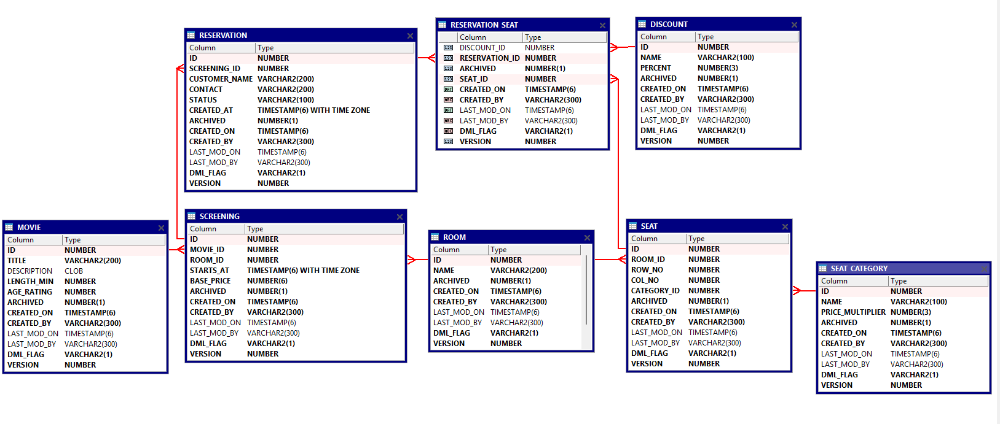

# Cinema adatbázis

Ez a repository egy `mozi foglalási rendszer` adatbázisát tartalmazza Oracle SQL / PL/SQL környezetben.

## Futtatás
- `00_sys_create_user` - SYS felhasználóként
- Az összes többi sql file számozás szerint növekvő sorba
  - username: `cinema`
  - password: `cinema`
## Táblák

- `movie` – filmek adatai
- `room` – mozitermek
- `seat_category` – szék kategóriák (pl. Standard, VIP)
- `seat` – termekhez tartozó székek (sor, oszlop, kategória)
- `screening` – vetítések (film + terem + időpont)
- `reservation` – foglalások
  - `status` aktív, default értéke `ACTIVE`.
  felhasználó visszavonás esetén `CANCELLED`.
  Jegy kifizetése esetén `REDEEMED`.
  A rendszerben ez nincs implementálva, csupán a bevétel statisztika számításnál van figyelembe véve. Az csak a `REDEEMED` foglalásokat veszi figyelembe.

- `discount` – kedvezmények
- `reservation_seat` – foglaláshoz tartozó székek kedvezményekkel (kapcsoló tábla)

#### Kiegészítő és technikai táblák
- `error_log` – hibák naplózása PL/SQL eljárásokból
- `change_history` – módosítások és hívások naplózása

## Azonosítók kezelése (ID generálás)

Az egyedi azonosítók (id mezők) feltöltése minden táblán adatbázis triggerrel történik.

- Insert művelet előtt `BEFORE INSERT` trigger fut le
- Az ID értéke egy `sequence` segítségével kerül beállításra
- Az alkalmazás nem ad meg ID-t, azt az adatbázis generálja

## Technikai attribútumok

Az adatbázis táblái egységes technikai mezőket tartalmaznak az auditálás és a módosítások nyomon követése érdekében.
Ez triggerrel autómatikusan módosításra kerül minden entity esetében.

- `created_on` – rekord létrehozásának időpontja
- `created_by` – a létrehozást végrehajtó adatbázis felhasználó
- `last_mod_on` – utolsó módosítás időpontja
- `last_mod_by` – utolsó módosítást végrehajtó felhasználó
- `archived` – logikai törlés jelző (0 = aktív, 1 = archivált) 
- `version` – verziószám, módosításkor növelendő
- `dml_flag` – utolsó DML művelet típusa
  - `I` – Insert
  - `U` – Update
  - `D` – Delete (soft delete)

## Archiválási szabályok

A rendszer logikai törlést alkalmaz az adatok fizikai törlése helyett.

- a rendszerben csak soft delete van, ami `UPDATE` hívással végezhető el
- `DELETE` művelet le van tiltva (exception-el)
- `reservation` archiválása esetén a hozzá tartozó `reservation_seat` rekordok automatikusan archiválásra kerülnek.

## Diagram
